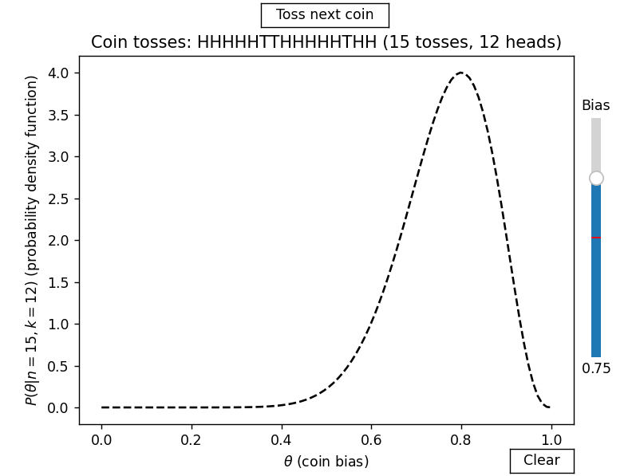

# Coin Bias Experiment

This repository contains an interactive application that demonstrates how Bayesian inference can be applied to estimate the bias of a coin based on a series of coin tosses. The application is built using Python and utilizes matplotlib widgets for interactivity.

## Motivation

Bayesian inference is a cornerstone of modern statistics and machine learning. This project showcases its power and simplicity by focusing on a classic example: estimating the bias (\( \theta \)) of a coin as evidence (coin tosses) accumulates.

The project is both educational and interactive, making it an excellent resource for learners and enthusiasts who want to deepen their understanding of Bayesian concepts.

## How It Works

1. **Bayesian Update Rule**: The application uses Bayes' Theorem to update the posterior probability density of the coin bias after each toss.
2. **Interactive Features**: 
   - Adjust the coin's bias (\( \theta \)) using a slider.
   - Toss the coin and watch the probability density function (PDF) update dynamically.
   - Clear the experiment to start over.
3. **Theoretical Foundation**: The probability density follows a Beta distribution, which depends on the number of tosses (\( n \)) and the number of heads (\( k \)) observed.

For more details, consult the [theory document](./theory_coin_experiment.pdf).

## Features

- Visualize the Bayesian updating process in real time.
- Experiment with different coin biases.
- Educational tool for learning Bayesian inference and the Beta distribution.

## Getting Started

### Prerequisites

Ensure you have Python 3.8 or later installed. The required libraries are listed in `requirements.txt`.

### Installation

1. Clone the repository:
   ```bash
   git clone https://github.com/cego669/CoinBiasExperiment.git
   cd CoinBiasExperiment
   ```
2. Install the dependencies:
   ```bash
   pip install -r requirements.txt
   ```
3. Run the application:
   ```bash
   python coin_toss_experiment.py
   ```
## Dependencies

The following Python libraries are required:
- matplotlib
- sympy
- numpy
- scipy

For a full list of dependencies and their versions, refer to [`requirements.txt`](./requirements.txt).

## Interactive Demo



- Use the slider to set the bias of the coin.
- Click "Toss next coin" to add a toss and observe the updated posterior distribution.
- Clear the experiment to reset.

## Documentation

For a detailed mathematical explanation of the Bayesian model and Beta distribution, refer to:
- [Theory Document (English)](./theory_coin_experiment.pdf)
- [Documento Teórico (Português)](./teoria_experimento_moedas.pdf)

## Author

- **Carlos Eduardo Gonçalves de Oliveira**
  - LinkedIn: [linkedin.com/in/cego669](https://www.linkedin.com/in/cego669)
  - GitHub: [github.com/cego669](https://github.com/cego669)

## License

This project is licensed under the MIT License. See the [LICENSE](./LICENSE) file for details.
